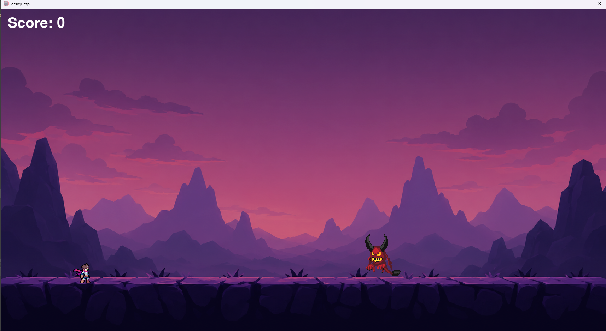
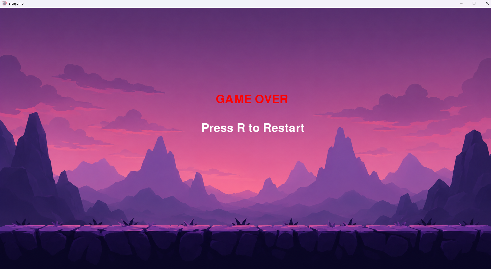

ersiejump

A 2D pixel-art survival platformer made with Pygame.

Gameplay

Control a hero and survive as long as possible while avoiding a flying demon.

Every point increases the game speed, making survival more difficult over time.

Try to beat your highest score.

Controls

A / D - Move

Space - Jump

ESC - Stop music

Features
Endless gameplay
Increasing difficulty
Score system
Pixel-art graphics
Lofi fantasy style
Developer: Ersiemore

Credits

See CREDITS.md

# ErsieJump

