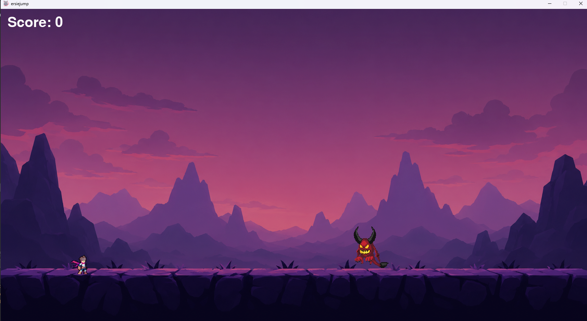
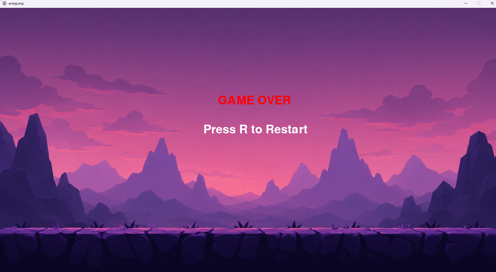

# ErsieJump

A 2D pixel-art survival platformer made with **Python** and **Pygame**.

## About the Game

**ErsieJump** is a fast-paced survival platformer where you control a hero and try to survive as long as possible while avoiding flying enemies.

The game now features a new forest location with a dark fantasy-style pixel-art atmosphere.

As you survive, your score increases and the game becomes more difficult. The goal is to get the highest score possible.

## Gameplay

- Run and jump through the level.
- Avoid flying enemies.
- Earn points by surviving.
- Enemy speed increases as the score grows.
- Reach the required score to move to the next world.
- Try to beat your best score.

## Controls

| Key | Action |
|---|---|
| `A` | Move left |
| `D` | Move right |
| `SPACE` | Jump |
| `TAB` | Stop music |
| `ESC` | Return to menu |
| `R` | Restart after Game Over |
| `SPACE` | Start the game from the menu |

## Features

- 2D pixel-art graphics
- Animated player
- Multiple enemy animations
- Two game worlds
- Forest environment
- Increasing difficulty
- Score and best-score system
- Background music
- Game Over and restart system
- Pygame-based gameplay

## Screenshots

### Gameplay



### Game Over



### NewWorld


## Project Structure

```text
ErsieJump/
├── assets/
│   ├── bg/
│   ├── buttons/
│   ├── enemy/
│   ├── icon/
│   ├── idle anim/
│   ├── jump anim/
│   ├── music/
│   ├── new_enemy/
│   └── run anim/
├── screenshots/
├── platformer.py
├── requirements.txt
└── README.md
```

## Installation

Clone the repository:

```bash
git clone https://github.com/YOUR-USERNAME/YOUR-REPOSITORY.git
cd YOUR-REPOSITORY
```

Install the dependencies:

```bash
pip install -r requirements.txt
```

Run the game:

```bash
python platformer.py
```

## Build EXE

To create a standalone Windows executable:

```cmd
pyinstaller --clean --noconfirm --onefile --windowed --name ErsieJump --add-data "assets;assets" platformer.py
```

The finished executable will be created in:

```text
dist/ErsieJump.exe
```

## Credits

Created with **Python** and **Pygame**.
